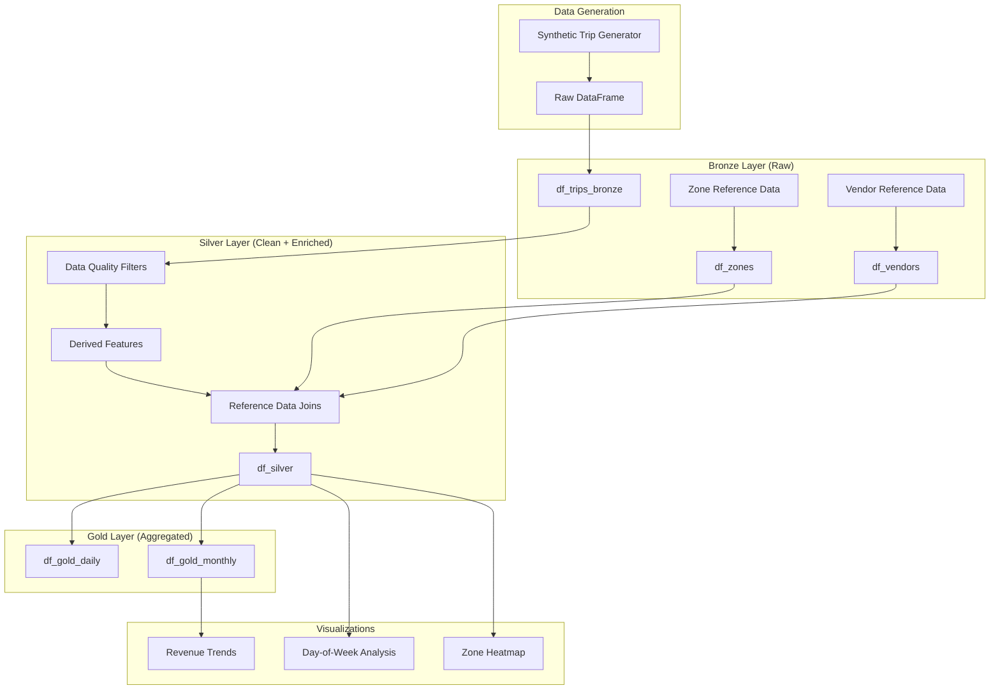

# NYC Taxi Monolithic Notebook

## Table of Contents

- [Overview](#overview)
- [Prerequisites](#prerequisites)
- [Data Pipeline Architecture](#data-pipeline-architecture)
- [Notebook Sections](#notebook-sections)
  - [Setup and Configuration](#setup-and-configuration)
  - [Data Generation](#data-generation)
  - [Bronze Layer](#bronze-layer)
  - [Silver Layer](#silver-layer)
  - [Gold Layer](#gold-layer)
  - [Visualizations](#visualizations)
- [Key Features](#key-features)
- [Usage](#usage)
- [Related Documentation](#related-documentation)

## Overview

The `nyc_taxi_monolithic.ipynb` notebook is a self-contained Databricks notebook that demonstrates a complete data engineering workflow using synthetic NYC taxi trip data. It implements the medallion architecture (Bronze → Silver → Gold) pattern commonly used in data lakehouse environments.

> [!NOTE]
> This notebook generates synthetic data for demonstration purposes and does not require external data sources.

## Prerequisites

Before running this notebook, ensure you have:

- A Databricks workspace with a compatible Spark runtime
- Python 3.x with the following libraries:
  - `pyspark`
  - `pandas`
  - `numpy`
  - `matplotlib`
  - `seaborn`
- Sufficient cluster resources (recommended: at least 2 workers)

## Data Pipeline Architecture

The notebook implements a three-layer medallion architecture for data processing:



## Notebook Sections

### Setup and Configuration

The first cell initializes the Spark session and imports required libraries:

```python
from pyspark.sql import SparkSession
from pyspark.sql import functions as F
from pyspark.sql import types as T
import pandas as pd
import numpy as np
```

> [!IMPORTANT]
> The notebook sets `spark.sql.shuffle.partitions` to 200 for optimal performance with the generated dataset size.

### Data Generation

The notebook generates synthetic NYC taxi trip data spanning from 2021 to 2025 with realistic patterns:

| Factor | Description |
|--------|-------------|
| Yearly Trend | 2021 has depressed demand (65%); recovery through 2022-2023; growth in 2024-2025 |
| Seasonality | Higher demand in summer and holidays; lower in January-February |
| Day-of-Week | Weekend trips are slightly higher for leisure travel |
| Time-of-Day | Commute peaks at 7-9am and 4-7pm; nightlife activity 10pm-2am |
| Zones | Manhattan, Brooklyn, Queens, Bronx, Staten Island, JFK, LGA |

Key parameters in the data generation:

- **Base fare**: $2.75
- **Per mile rate**: $2.50
- **Per minute rate**: $0.60
- **Airport surcharge**: $1.75
- **Night surcharge**: $0.50
- **Peak surcharge**: $0.70

### Bronze Layer

The Bronze layer maintains raw data with minimal transformations:

- **df_trips_bronze**: Raw trip records with 13 columns
- **df_zones**: Zone-to-borough mapping (7 zones)
- **df_vendors**: Vendor information (CMT, VTS)

Schema for trip records:

| Column | Type | Description |
|--------|------|-------------|
| trip_id | string | Unique identifier (format: YYYYMMDD-N) |
| pickup_datetime | timestamp | Trip start time |
| dropoff_datetime | timestamp | Trip end time |
| pickup_zone | string | Pickup location zone |
| dropoff_zone | string | Dropoff location zone |
| passenger_count | long | Number of passengers |
| trip_distance_mi | double | Trip distance in miles |
| trip_duration_min | double | Trip duration in minutes |
| fare_amount | double | Base fare amount |
| tip_amount | double | Tip amount |
| total_amount | double | Total charge |
| payment_type | string | CARD, CASH, or E-PAY |
| vendor | string | CMT or VTS |

### Silver Layer

The Silver layer applies data quality filters and feature engineering:

**Quality Filters:**

- Trip distance > 0.2 miles
- Trip duration > 2.0 minutes
- Fare amount > $3.00

**Derived Features:**

| Feature | Calculation |
|---------|-------------|
| pickup_date | Date extracted from pickup_datetime |
| year, month, day, hour | Temporal components |
| speed_mph | trip_distance_mi / (trip_duration_min / 60) |
| airport_trip | 1 if pickup or dropoff is JFK/LGA, else 0 |
| surge_proxy | (total_amount - fare_amount) / fare_amount |

**Reference Data Joins:**

- Pickup/dropoff borough from zone reference
- Vendor name from vendor reference

### Gold Layer

The Gold layer provides aggregated KPIs at two granularities:

**Daily Aggregations (df_gold_daily):**

Grouped by: `pickup_date`, `pickup_zone`

**Monthly Aggregations (df_gold_monthly):**

Grouped by: `year`, `month`, `pickup_zone`

**Metrics Calculated:**

- `trips`: Count of trips
- `revenue`: Sum of total_amount
- `avg_fare`: Average fare_amount
- `tip_pct`: Sum of tips / Sum of fares
- `avg_speed_mph`: Average speed
- `airport_share`: Proportion of airport trips

### Visualizations

The notebook includes three visualization types:

1. **Revenue Trend Chart**: Monthly revenue time series
2. **Day-of-Week Analysis**: Bar chart showing trip distribution by weekday
3. **Zone Heatmap**: Average fare by pickup/dropoff zone combination

> [!TIP]
> The visualizations use a 5% sample of the Silver data to optimize rendering performance.

## Key Features

- **Self-contained**: No external data dependencies; generates its own synthetic data
- **Realistic patterns**: Incorporates yearly trends, seasonality, time-of-day effects, and zone-based variations
- **Holiday awareness**: Includes logic for major US holidays (New Year's, Independence Day, Thanksgiving, Memorial Day, Labor Day, Christmas)
- **Surge pricing simulation**: Models demand-based surge multipliers
- **Complete medallion architecture**: Demonstrates Bronze → Silver → Gold data transformation pattern
- **Visualization ready**: Includes pandas-based plots using matplotlib and seaborn

## Usage

1. Upload the notebook to your Databricks workspace
2. Attach to a cluster with Spark 4.0.0+
3. Run all cells sequentially

To adjust the data volume, modify the `base_per_day` parameter in the `generate_data()` call:

```python
# Current setting: 1200 trips per day (for demo speed)
# The function default is 5000, but notebook uses 1200 for faster execution
df_pd = generate_data(base_per_day=1200)

# For full-scale testing: use the default or higher values
df_pd = generate_data(base_per_day=5000)
```

> [!CAUTION]
> Increasing `base_per_day` significantly will increase memory usage and processing time. Ensure your cluster has adequate resources.

## Related Documentation

- [README.md](../README.md) - Project overview and setup instructions
- [Ingestion Scripts](./ingestion/) - Production ingestion notebooks
- [SQL Scripts](./sql/) - Table DDL and curated layer definitions
- [Optimization](./optimization/) - OPTIMIZE, VACUUM, and ANALYZE operations
- [Quality Checks](./quality/) - Data validation notebooks
